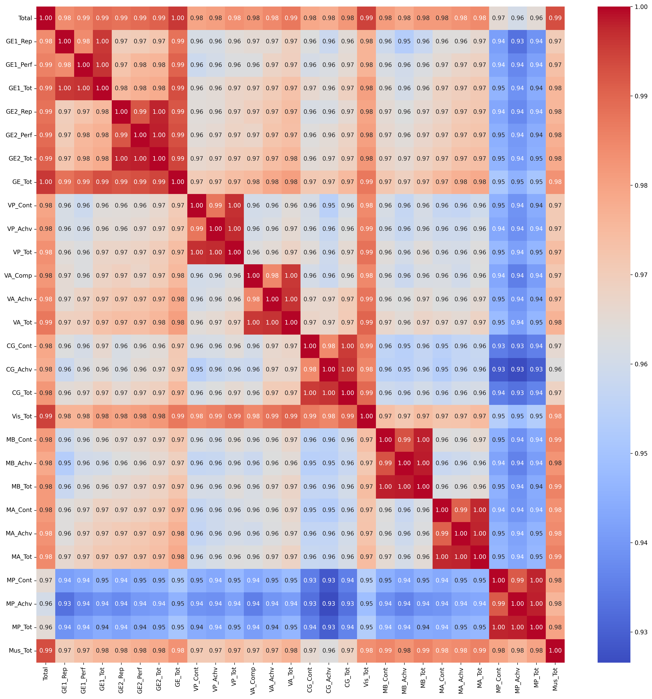
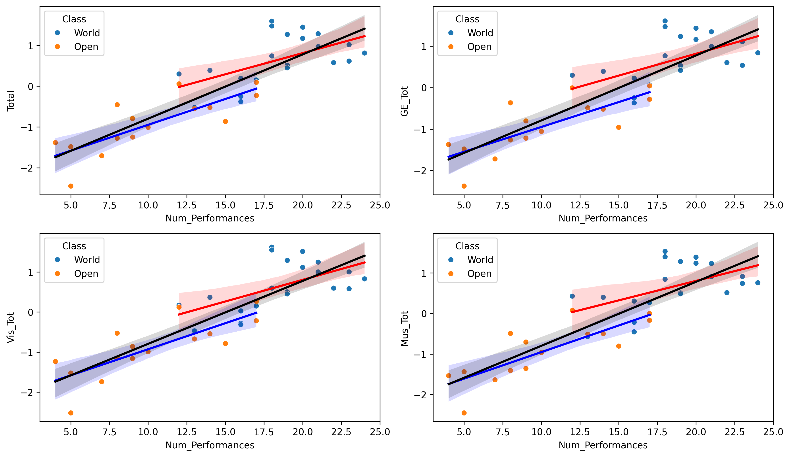

# Drum Corps International 2024 - Scores and Analysis

> [!WARNING]
> This repo is still a work-in-progress.

### Background
This year, I started working towards earning my Master's degree in Data Analysis. However, prior to that, I was (and still am, on occasion) involved in the Drum Corps activity as a photographer; I interned with Drum Corps International in 2019 and was a freelance photographer with The Cavaliers Drum & Bugle Corps in 2021.

To someone on the outside of the activity, the idea of what is essentially competitive marching band might seem crazy. And it is, trust me. But one thing about drum corps that I always thought was interesting was all the data a full season produces.

The competitive season starts toward the end of June, and lasts until the second weekend in August, roughly 45 days, give or take a few. In that time, there are over 35 corps performing at over 70 stadiums across the country.

My goal with this repo is to take a look under the hood as best I can to see what's really going on during the 45 days on the Drum Corps International summer tour.

### About the Dataset
Unfortunately, due to the way scores get posted to [dci.org](dci.org), all of my attempts at scraping the data was met with failure. Luckily for me, I had time to spare and a penchant for entering data correctly the first time (usually).

I spent the summer going over the recaps posted by DCI individually, entering the data by hand into a master spreadsheet using Excel. From there, I was able to automate some manner of the entry process, including totaling scores.

I wanted to include as much information as I could; I wanted to be able to look at show locations, dates and the class each corps competes in to really see the trends in the data. Below are the explanations of each of the important columns. **More in-depth explanations for each scoring category can be found [here](https://issuu.com/drumcorpsinternational/docs/2012_judging_sheets_full_set?e=1376842/2992110).**

* **Date**: Date of performance
* **Location**: Location of performance
* **Corps**: Corps name
* **Class**: Class the corps competes in; either World, Open or All-Age
* **Rank**: Placement of the corps at their respective show (NOTE: this is *not* an overall ranking)
* **Total**: Total score. *GE_Tot + Vis_Tot + Mus_Tot + Penalties*
* **CTot**: Calculated total; used for accuracy and redundancy; you can ignore this
* **GE_Rep**: General Effect - Repertoire Effect
* **GE_Perf**: General Effect - Performers
* **GE_Tot**: General Effect - Total
* **VP_Cont**: Visual Proficiency - Content
* **VP_Achv**: Visual Proficiency - Achievement
* **VP_Tot**: Visual Proficiency - Total
* **VA_Comp**: Visual Analysis - Composition
* **VA_Achv**: Visual Analysis - Achievement
* **VA_Tot**: Visual Analysis - Total
* **CG_Cont**: Color Guard - Content
* **CG_Achv**: Color Guard - Achievement
* **CG_Tot**: Color Guard - Total
* **Vis_Tot**: Visual Total
* **MB_Cont**: Music (Brass) - Content
* **MB_Achv**: Music (Brass) - Achievement
* **MB_Tot**: Music (Brass) - Total
* **MA_Cont**: Music Analysis - Content
* **MA_Achv**: Music Analysis - Achievement
* **MA_Tot**: Music Analysis - Total
* **MP_Cont**: Music (Percussion) - Content
* **MP_Achv**: Music (Percussion) - Achievement
* **MP_Tot**: Music (Percussion) - Total
* **Mus_Tot**: Music Total
* **Penalties**: Score deductions, if any

### About the Notebooks and Scripts
I have included a few Python scripts as well as Jupyter notebooks. The scripts are largely meant to write new .csv files to be used in the notebooks; the notebooks are where most of my analyses will be stored.

Below are explanations for each file included in the Python Notebooks and Python Scripts folders included in this repo.

* **DCI2024.ipynb**: My main notebook. The majority of my analyses and charts can be found here.
* **geocode.py**: Used to assign a latitude and longitude to each location. Created using Opencage's API (I've removed my API key. Get your own [here](https://opencagedata.com/))

## Analysis

> [!NOTE]
> The analysis included here can also be viewed on [Kaggle]() with the code and additional information.

> [!IMPORTANT]
> For the majority of my analyses, I will be excluding All-Age corps. All-Age is a class that has its own set of guidelines and scoring criteria that differs from World and Open class, so including it in analyses may skew the data in ways that are not accurate.

For the majority of my analyses, I will not be using the 'GE1_Rep2', 'GE1_Perf2', 'GE1_Tot2', 'GE2_Rep2', 'GE2_Perf2', 'GE2_Tot2', 'MA_Cont2', 'MA_Achv2', and 'MA_Tot2' columns, due to them only being used at the major competitions. In the event I specifically look at events that include scores in those columns, I will include them.

To start, I wanted to take a look at a correlation matrix to see the relation between each of the variables.

As might be expected, there's a pretty strong correlation amongst everything. One thing that stuck out immediately is the lower-than-average correlation between MP_Cont, MP_Achv and MP_Tot and the rest of the variables. Through speculation with some of my peers in the drum corps activity, we've settled on this likely being due to how percussion works in the drum corps activity.

Percussion is scored based on the front ensemble and the drumline. The front ensemble includes instruments such as the marimba, xylophone, vibroaphone, drumset, auxilliary percussion and string instruments on ocassion. It also (usually) involves no marching at all, instead focusing more on music. Drumline includes instruments such as the marching snare, marching bass drums, marching tenors and cymbals (most corps no longer use cymbals, but there are a few that still do).

When looking at the descriptive stats of the dataset, we can see the stats for the Percussion variables below:

|       | MP_Cont    | MP_Achv    | MP_Tot    |
|-------|------------|------------|-----------|
| count | 542.000000 | 542.000000 | 542.000000|
| mean  | 7.895018   | 7.666790   | 15.561808 |
| std   | 1.055486   | 1.114571   | 2.165461  |
| min   | 4.900000   | 4.500000   | 9.400000  |
| 25%   | 7.200000   | 7.000000   | 14.100000 |
| 50%   | 7.900000   | 7.700000   | 15.600000 |
| 75%   | 8.700000   | 8.500000   | 17.200000 |
| max   | 9.900000   | 9.850000   | 19.750000 |

Let's break this down further. To start, let's compare the means of each of the three main categories.

Since the margin is so small across the board here, let's perform a quick ANOVA test to see if there actually is any statistical significance.

In our case, we will be setting our alpha to 0.05; any P-value smaller than 0.05 will be considered statistically significant.

**Our H0 (null hypothesis) will be:** The difference in means of Percussion scores compared to other scores is not statistically significant.

**Our H1 (alternative hypothesis) will be:** The difference in means of Percussion scores compared to other scores is statistically significant.

Looking at the results of our ANOVA test for each of the three groups, we get this:

`ANOVA test for Content: F-value = 0.7766216816152612, P-value = 0.5664424738144958`

`ANOVA test for Achievement: F-value = 0.5393703927105752, P-value = 0.7465806478309788`

`ANOVA test for Total: F-value = 0.5995213796886008, P-value = 0.7003546566691863`

None of the P-values are smaller than our alpha value, so we can accept our null hypothesis: **There is no statistical significance in the difference in means of Percussion scores compared to the other scores**.

And, just for the hell of it, let's perform a Tukey's HSD test just to take a closer look and everything as a whole.

### Multiple Comparison of Means - Tukey HSD, FWER=0.05

#### Content
| group1 | group2 | meandiff | p-adj  | lower  | upper  | reject |
|--------|--------|----------|--------|--------|--------|--------|
| CG     | MA     | 0.014    | 0.9999 | -0.1649| 0.1929 | False  |
| CG     | MB     | 0.1044   | 0.5557 | -0.0745| 0.2833 | False  |
| CG     | MP     | 0.0245   | 0.9988 | -0.1544| 0.2035 | False  |
| CG     | VA     | 0.0498   | 0.9686 | -0.1291| 0.2287 | False  |
| CG     | VP     | 0.0058   | 1.0    | -0.1731| 0.1847 | False  |
| MA     | MB     | 0.0904   | 0.702  | -0.0885| 0.2693 | False  |
| MA     | MP     | 0.0105   | 1.0    | -0.1684| 0.1894 | False  |
| MA     | VA     | 0.0358   | 0.9929 | -0.1431| 0.2147 | False  |
| MA     | VP     | -0.0082  | 1.0    | -0.1871| 0.1707 | False  |
| MB     | MP     | -0.0799  | 0.7998 | -0.2588| 0.099  | False  |
| MB     | VA     | -0.0546  | 0.9536 | -0.2335| 0.1243 | False  |
| MB     | VP     | -0.0986  | 0.6174 | -0.2775| 0.0803 | False  |
| MP     | VA     | 0.0253   | 0.9986 | -0.1536| 0.2042 | False  |
| MP     | VP     | -0.0187  | 0.9997 | -0.1976| 0.1602 | False  |
| VA     | VP     | -0.044   | 0.9818 | -0.2229| 0.1349 | False  |

#### Achievement
| group1 | group2 | meandiff | p-adj  | lower  | upper  | reject |
|--------|--------|----------|--------|--------|--------|--------|
| CG     | MA     | 0.0475   | 0.9816 | -0.1451| 0.2401 | False  |
| CG     | MB     | 0.086    | 0.7999 | -0.1066| 0.2786 | False  |
| CG     | MP     | 0.0244   | 0.9992 | -0.1682| 0.217  | False  |
| CG     | VA     | 0.0243   | 0.9992 | -0.1683| 0.2169 | False  |
| CG     | VP     | -0.012   | 1.0    | -0.2046| 0.1806 | False  |
| MA     | MB     | 0.0385   | 0.993  | -0.1541| 0.2311 | False  |
| MA     | MP     | -0.0232  | 0.9994 | -0.2158| 0.1694 | False  |
| MA     | VA     | -0.0232  | 0.9994 | -0.2158| 0.1694 | False  |
| MA     | VP     | -0.0595  | 0.9511 | -0.2521| 0.1331 | False  |
| MB     | MP     | -0.0616  | 0.9435 | -0.2542| 0.131  | False  |
| MB     | VA     | -0.0617  | 0.9431 | -0.2543| 0.1309 | False  |
| MB     | VP     | -0.098   | 0.6959 | -0.2906| 0.0946 | False  |
| MP     | VA     | -0.0001  | 1.0    | -0.1927| 0.1925 | False  |
| MP     | VP     | -0.0363  | 0.9946 | -0.2289| 0.1563 | False  |
| VA     | VP     | -0.0363  | 0.9947 | -0.2289| 0.1563 | False  |

#### Total
| group1 | group2 | meandiff | p-adj  | lower  | upper  | reject |
|--------|--------|----------|--------|--------|--------|--------|
| CG     | MA     | 0.0615   | 0.997  | -0.3089| 0.432  | False  |
| CG     | MB     | 0.1904   | 0.6863 | -0.18  | 0.5608 | False  |
| CG     | MP     | 0.0489   | 0.999  | -0.3215| 0.4193 | False  |
| CG     | VA     | 0.0741   | 0.9929 | -0.2964| 0.4445 | False  |
| CG     | VP     | -0.0062  | 1.0    | -0.3766| 0.3643 | False  |
| MA     | MB     | 0.1289   | 0.9206 | -0.2416| 0.4993 | False  |
| MA     | MP     | -0.0126  | 1.0    | -0.3831| 0.3578 | False  |
| MA     | VA     | 0.0125   | 1.0    | -0.3579| 0.383  | False  |
| MA     | VP     | -0.0677  | 0.9954 | -0.4382| 0.3027 | False  |
| MB     | MP     | -0.1415  | 0.8858 | -0.512 | 0.2289 | False  |
| MB     | VA     | -0.1163  | 0.9477 | -0.4868| 0.2541 | False  |
| MB     | VP     | -0.1966  | 0.6558 | -0.567 | 0.1739 | False  |
| MP     | VA     | 0.0252   | 1.0    | -0.3453| 0.3956 | False  |
| MP     | VP     | -0.0551  | 0.9983 | -0.4255| 0.3154 | False  |
| VA     | VP     | -0.0803  | 0.9898 | -0.4507| 0.2902 | False  |

Let's take a quick look at standard deviation now, to see what the variation of each variable looks like:

We can see that Perucssion has a standard deviation that is a bit greater than the average

Both of these factors can contribute to the observed differences in correlation values: Percussion tends to have a greater than average variance in scores, and its average score is higher than the averages of the other variables. However, it's important to note that correlation measures the strength and direction of a linear relationship between two variables, so these factors alone do not fully explain the differences in correlation.

It should finally be pointed out that scoring in drum corps is subjective, despite the insistence on following pre=established judging guidelines. The activity employs several different judges throughout the season, so no corps will ever be score by the same set of judges all summer. Some judges may score harsher than others, while some may have some inherent bias towards certain corps. While my objective with this section was to explain the activity purely on numbers, it's a tough task when the activity is so heavily reliant on art, an infamously subjective field.

Now that I mention the activity having a heaping dose of subjectivity, let's go ahead and see which corps are objectively the best by ranking them based on their final Total score.

I've colored the bars based on the corp's class. This gives us a better look at how each class stacks up in the final rankings.

The Bluecoats from Canton, OH, took home gold this year, beating out the 2nd place Boston Crusaders from Boston, MA, and the 3rd place Blue Devils from Concord, CA.

Some quick facts, if you're unfamiliar:

* The Bluecoats have only ever won once before, in 2016 with a score of 97.650.
* The Bluecoats were undefeated, never finishing lower than 1st place in any of the shows they performed at.
* The Boston Crusaders had never placed higher than 5th until 2022, when they tied for 2nd with the Bluecoats, scoring 97.325
* The Blue Devils have not finished lower than 2nd place since 2006.
* The Blue Devils have 21 1st place finishes (including two ties), most of any drum corps by a wide margin. In second is the now-defunct The Cadets from Allentown, PA with 10 (one tie).

It was an exciting year, to say the least.

Now, let's take a look at some score distributions, starting off with Total and the three major Captions: General Effect (GE_Tot), Visual (Vis_Tot) and Music (Mus_Tot).

Here are the descriptive stats:

### Score Distributions - Descriptive Stats

|       | Total      | GE_Tot     | Vis_Tot    | Mus_Tot    |
|-------|------------|------------|------------|------------|
| count | 542.000000 | 542.000000 | 542.000000 | 542.000000 |
| mean  | 77.243173  | 30.959041  | 23.109225  | 23.181375  |
| std   | 10.409718  | 4.146588   | 3.146771   | 3.171661   |
| min   | 45.800000  | 18.000000  | 13.450000  | 13.650000  |
| 25%   | 70.462500  | 28.400000  | 21.200000  | 21.050000  |
| 50%   | 77.425000  | 31.000000  | 23.100000  | 23.250000  |
| 75%   | 84.928500  | 33.993750  | 25.337500  | 25.550000  |
| max   | 98.750000  | 39.650000  | 29.650000  | 29.450000  |

There are no really surprising trends here. Everything is distributed in a realtively normal way, as seen by the red dashed curves on the distribution plots above.

Let's break this down even further, seeing how the scores get distributed based on Class.

### World Class Distributions

### Open Class Distributions

We can see that while the World class distributions look more uniform, Open class has some more peaks scattered throughout their distributions, moving away from the previously normal distribution when classes were combined. Again, this is likely due to the varying degrees of talent and season length of some of the younger Open class corps.

Having mentioned length of a corps' tour, let's take a look at how many times each corps performed throughout the summer. This can help us hone in on whether or not the number of performances impacts a corps' scores.

With a max performance count of 24 and a min of 4, we can see there's a pretty good range of performance counts. We can also see that Open class corps have fewer performances on average, with an average performance count of 11.88, whereas World class corps perform an average of 19.08 times.

Let's look take a look at a few scatter plots now to see if there's any correlation between number of performances and the main caption scores. However, for this, let's look at each corps' final scores; looking at a final stat like number of performances and comparing it to a running stat such as an entire season's worth of scores isn't fitting.

Even though the scatter points are somewhat sparse here now that we've filtered out all scores prior to each corps' final performance, we can see there is a relationship here.

Let's now take a look at the R^2 values.

### World Class

`World Total R^2: 0.30924823082612585, Adjusted R^2: 0.2728928745538167`

`World GE_Tot R^2: 0.3128868375206688, Adjusted R^2: 0.2767229868638619`

`World Vis_Tot R^2: 0.32140508691676817, Adjusted R^2: 0.28568956517554545`

`World Mus_Tot R^2: 0.2821444468179922, Adjusted R^2: 0.24436257559788654`

### Open Class

`Open Total R^2: 0.6118601720659191, Adjusted R^2: 0.582003262224836`

`Open GE_Tot R^2: 0.5807340882399009, Adjusted R^2: 0.5484828642583548`

`Open Vis_Tot R^2: 0.6063617266608128, Adjusted R^2: 0.5760818594808752`

`Open Mus_Tot R^2: 0.636082265204573, Adjusted R^2: 0.6080885932972324`

### Overall

`Overall Total R^2: 0.7424706233694873, Adjusted R^2: 0.7348962299391781`

`Overall GE_Tot R^2: 0.735309311236244, Adjusted R^2: 0.7275242909784865`

`Overall Vis_Tot R^2: 0.7402798459843105, Adjusted R^2: 0.7326410179250256`

`Overall Mus_Tot R^2: 0.7435144637898464, Adjusted R^2: 0.7359707715483713`

As we can see from the values above, World class has the lowest R^2 and Adjusted R^2 values, telling us there is little explanation in how number of performances influences the scores.

